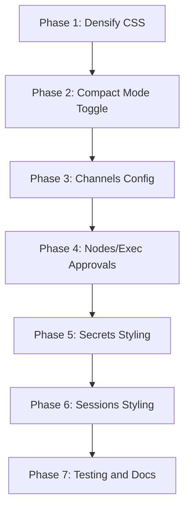

# VS Code-Style Hierarchical Settings Grid Improvement Plan

## Executive Summary

This plan addresses the user's concerns about the config settings UI:
1. **Too much scrolling** - Low information density per screen
2. **Can't see enough settings** - Large vertical footprint per setting
3. **Inconsistent UI** - Different views use different approaches

The solution involves densifying the existing PropertyGrid component and expanding its use across all settings views.

---

## Current State Analysis

### Existing PropertyGrid Component

Location: [`ui/src/ui/components/property-grid/`](../../ui/src/ui/components/property-grid/index.ts)

**What exists:**
- Hierarchical property paths with collapsible sections
- Type-specific inline editors: string, number, boolean, enum, array, object
- Search functionality with character-level highlighting
- Change tracking with diff display
- CSS grid layout with two columns: Property and Value

**Current usage:**
- Main Config view has a Grid mode toggle that uses PropertyGrid
- Grid mode is the default when entering the Config view

### Settings Views Inventory

| View | File | Current Approach | Uses PropertyGrid? | Priority |
|------|------|------------------|-------------------|----------|
| Config | [`config.ts`](../../ui/src/ui/views/config.ts) | Grid/Form/Raw modes | ✅ Yes | - |
| Channels Config | [`channels.config.ts`](../../ui/src/ui/views/channels.config.ts) | renderNode form | ❌ No | High |
| Exec Approvals | [`nodes.ts:557`](../../ui/src/ui/views/nodes.ts) | Custom cards | ❌ No | Medium |
| Node Bindings | [`nodes.ts:465`](../../ui/src/ui/views/nodes.ts) | Custom list | ❌ No | Medium |
| Secrets | [`secrets.ts`](../../ui/src/ui/views/secrets.ts) | Custom list + modal | ❌ No | Low |
| Sessions | [`sessions.ts`](../../ui/src/ui/views/sessions.ts) | Card grid | ❌ No | Low |

---

## Proposed Architecture

### Phase 1: Densify PropertyGrid CSS

**Goal:** Reduce vertical space per row by 40-50%

**Changes to [`property-grid.css`](../../ui/src/ui/components/property-grid/property-grid.css):**

```css
/* Current */
.pg-row {
  min-height: 36px;
  padding: 0 16px;
}

/* Proposed compact mode */
.pg--compact .pg-row {
  min-height: 28px;
  padding: 0 12px;
}

.pg--compact .pg-row__path {
  padding: 4px 0;  /* was 8px */
}

.pg--compact .pg-editor__input {
  padding: 4px 8px;  /* was 6px 10px */
  font-size: 12px;   /* was 13px */
}
```

**Estimated impact:** 40% more settings visible per screen

### Phase 2: Add Compact Mode Toggle

**Changes to [`property-grid/types.ts`](../../ui/src/ui/components/property-grid/types.ts):**

```typescript
export interface PropertyGridConfig {
  // ... existing props
  compact?: boolean;  // NEW: Enable compact mode
}
```

**Changes to [`property-grid/property-grid.ts`](../../ui/src/ui/components/property-grid/property-grid.ts):**

```typescript
export function renderPropertyGrid(config: PropertyGridConfig): TemplateResult {
  const { compact = false, ...rest } = config;
  
  return html`
    <div class="pg ${compact ? 'pg--compact' : ''}">
      ...
    </div>
  `;
}
```

### Phase 3: Integrate into Channels Config

**Current approach in [`channels.config.ts`](../../ui/src/ui/views/channels.config.ts):**
- Uses `renderNode()` from config-form
- Renders each channel's config as a nested form

**Proposed changes:**
1. Replace `renderNode()` with `renderPropertyGrid()`
2. Pass channel-specific schema subset
3. Add compact mode by default

**Files to modify:**
- `ui/src/ui/views/channels.config.ts`
- `ui/src/ui/views/channels.ts` (add Grid mode toggle)

### Phase 4: Integrate into Nodes/Exec Approvals

**Current approach in [`nodes.ts`](../../ui/src/ui/views/nodes.ts):**
- `renderExecApprovals()` - Custom tabbed interface with dropdowns
- `renderBindings()` - Custom list with selects

**Proposed changes:**
1. Create JSON Schema for Exec Approvals structure
2. Render as PropertyGrid with security, ask, askFallback, autoAllowSkills properties
3. Keep per-agent tabs but render settings as PropertyGrid

**Files to modify:**
- `ui/src/ui/views/nodes.ts`
- Create `ui/src/ui/schemas/exec-approvals.ts` (schema definition)

### Phase 5: Integrate into Secrets View

**Current approach in [`secrets.ts`](../../ui/src/ui/views/secrets.ts):**
- Simple list with Edit/Delete buttons
- Modal for add/edit

**Assessment:** Secrets are key-value pairs without schema. PropertyGrid may not be ideal here.

**Alternative:** Keep current UI but apply consistent styling from PropertyGrid CSS.

### Phase 6: Integrate into Sessions View

**Current approach in [`sessions.ts`](../../ui/src/ui/views/sessions.ts):**
- Card-based grid layout
- Each session shows: label, tokens, thinking level, verbose, reasoning

**Assessment:** Sessions are row-based entities, not hierarchical config. PropertyGrid may not be ideal.

**Alternative:** Create a SessionGrid component using PropertyGrid's CSS patterns but optimized for row-based data.

---

## Implementation Order



### Detailed Task Breakdown

#### Phase 1: Densify PropertyGrid CSS - Estimated: 2-3 hours
- [ ] Add `.pg--compact` CSS class with reduced heights and padding
- [ ] Reduce section header vertical spacing
- [ ] Compact editor controls: smaller inputs, toggles, selects
- [ ] Test on various screen sizes

#### Phase 2: Add Compact Mode Toggle - Estimated: 1-2 hours
- [ ] Add `compact?: boolean` to `PropertyGridConfig`
- [ ] Apply class in `renderPropertyGrid()`
- [ ] Add toggle button to config sidebar
- [ ] Persist preference in local storage

#### Phase 3: Channels Config Integration - Estimated: 3-4 hours
- [ ] Replace `renderChannelConfigForm()` to use PropertyGrid
- [ ] Handle channel-specific schema extraction
- [ ] Add Grid/Form mode toggle to channel views
- [ ] Test with Discord, Telegram, Slack, Signal, WhatsApp, iMessage configs

#### Phase 4: Nodes/Exec Approvals Integration - Estimated: 4-5 hours
- [ ] Create JSON Schema for Exec Approvals file format
- [ ] Create `renderExecApprovalsPropertyGrid()` function
- [ ] Integrate with existing tab-based agent selection
- [ ] Update Node Bindings to use PropertyGrid rows
- [ ] Test save/load flow

#### Phase 5: Secrets Styling - Estimated: 1-2 hours
- [ ] Apply PropertyGrid-consistent styling to secrets list
- [ ] Use same row height, fonts, colors
- [ ] Keep modal-based editing

#### Phase 6: Sessions Styling - Estimated: 2-3 hours
- [ ] Create SessionGrid component with PropertyGrid aesthetics
- [ ] Use same row heights and inline editing patterns
- [ ] Maintain card layout but with denser rows

#### Phase 7: Testing and Documentation - Estimated: 2-3 hours
- [ ] Add unit tests for compact mode
- [ ] Test all PropertyGrid integrations
- [ ] Update developer documentation
- [ ] Create before/after screenshots

---

## Technical Details

### CSS Variables for Consistency

Add to `ui/src/styles.css`:

```css
:root {
  /* Settings Grid */
  --pg-row-height: 36px;
  --pg-row-height-compact: 28px;
  --pg-font-size: 13px;
  --pg-font-size-compact: 12px;
  --pg-padding-horizontal: 16px;
  --pg-padding-horizontal-compact: 12px;
}
```

### Schema Generation for Dynamic Views

For views like Exec Approvals that don't have a server-provided schema, create client-side schema definitions:

```typescript
// ui/src/ui/schemas/exec-approvals.ts
export const execApprovalsSchema: JsonSchema = {
  type: 'object',
  properties: {
    defaults: {
      type: 'object',
      title: 'Defaults',
      properties: {
        security: {
          type: 'string',
          enum: ['deny', 'allowlist', 'full'],
          default: 'deny'
        },
        ask: {
          type: 'string',
          enum: ['off', 'on-miss', 'always'],
          default: 'on-miss'
        },
        // ...
      }
    },
    agents: {
      type: 'object',
      additionalProperties: {
        // Per-agent schema
      }
    }
  }
};
```

---

## Success Metrics

1. **Density:** 40-50% more settings visible per screen in compact mode
2. **Consistency:** All config-like views use PropertyGrid or PropertyGrid-consistent styling
3. **Performance:** No regression in render time or interactivity
4. **Accessibility:** Maintain keyboard navigation and screen reader support

---

## Risks and Mitigations

| Risk | Impact | Mitigation |
|------|--------|------------|
| Breaking existing config forms | High | Keep Form mode as fallback |
| Complex nested schemas | Medium | Test with deep nesting scenarios |
| Mobile layout issues | Medium | Responsive CSS already exists; test on mobile |
| User preference loss | Low | Persist compact mode in localStorage |

---

## Dependencies

- Existing PropertyGrid component: [`ui/src/ui/components/property-grid/`](../../ui/src/ui/components/property-grid/)
- JSON Schema utilities: [`ui/src/ui/views/config-form.shared.ts`](../../ui/src/ui/views/config-form.shared.ts)
- Lit HTML: Already in use

---

## Next Steps

1. Review this plan with stakeholders
2. Begin Phase 1: CSS densification
3. Iterate based on feedback from real usage
