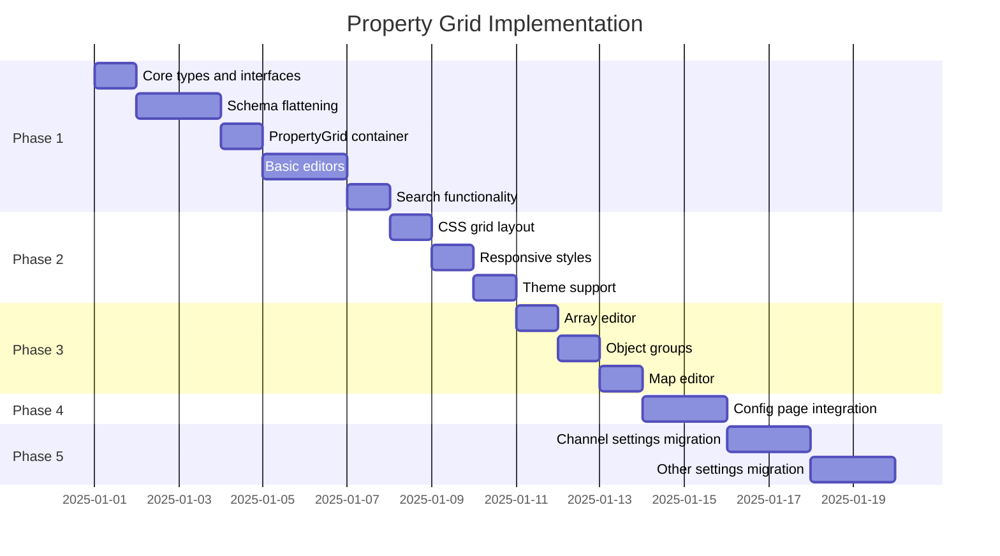

# VS Code-Style Property Grid Settings UI

## Overview

This document outlines the plan to replace the current settings UI with a VS Code-style hierarchical property grid that provides:

1. **Higher information density** - More settings visible on screen without scrolling
2. **Consistent interface** - Single component used across all settings surfaces
3. **JSON-native design** - Property paths displayed inline (e.g., `channels.telegram.token`)
4. **Unified architecture** - One component for Config, Channels, Agents, and all configuration views

## Current State Analysis

### Existing Components
- [`ui/src/ui/views/config.ts`](../../ui/src/ui/views/config.ts) - Main config page container
- [`ui/src/ui/views/config-form.render.ts`](../../ui/src/ui/views/config-form.render.ts) - Section cards renderer
- [`ui/src/ui/views/config-form.node.ts`](../../ui/src/ui/views/config-form.node.ts) - Individual field renderers
- [`ui/src/ui/views/config-form.shared.ts`](../../ui/src/ui/views/config-form.shared.ts) - Schema utilities
- [`ui/src/ui/views/config-form.analyze.ts`](../../ui/src/ui/views/config-form.analyze.ts) - Schema normalization
- [`ui/src/styles/config.css`](../../ui/src/styles/config.css) - Current card-based styling

### Problems with Current UI
1. **Section cards consume vertical space** - Headers, icons, and descriptions take up screen real estate
2. **Deep nesting requires scrolling** - Collapsible objects create vertical expansion
3. **Inconsistent layouts** - Channel configs have different UI patterns than main config
4. **Limited density** - Single-column fields with labels above inputs

## Target Design

### VS Code Settings Reference

VS Code's JSON settings editor uses a two-column property grid:
```
┌────────────────────────────────────────────────────────────────┐
│ Search settings...                                              │
├────────────────────────────────────────────────────────────────┤
│ Property Path                    │ Value                       │
├──────────────────────────────────┼─────────────────────────────┤
│ editor.fontSize                  │ [14        ]                │
│ editor.fontFamily                │ [Menlo, Monaco...]          │
│ editor.tabSize                   │ [2         ]                │
│ editor.wordWrap                  │ [off ▼]                     │
│ ▼ editor.minimap                 │                             │
│   editor.minimap.enabled         │ [✓]                         │
│   editor.minimap.side            │ [right ▼]                   │
│ files.autoSave                   │ [afterDelay ▼]              │
│ files.autoSaveDelay              │ [1000      ]                │
└──────────────────────────────────┴─────────────────────────────┘
```

### Key Design Principles

1. **Flat property paths** - Show full dot-notation paths like `channels.telegram.token`
2. **Inline editing** - Click on value to edit in place
3. **Collapsible groups** - Section headers collapse/expand children
4. **Fixed header row** - Property/Value column headers stay visible
5. **Compact rows** - Minimal vertical padding per setting
6. **Syntax highlighting** - Property paths colored for hierarchy
7. **Search highlighting** - Match highlighting in both path and value

## Architecture

### Component Hierarchy

```
PropertyGrid
├── PropertyGridHeader          # Column headers + search
├── PropertyGridBody            # Virtualized scrollable area
│   ├── PropertyGridSection     # Collapsible group header
│   └── PropertyGridRow         # Individual setting row
│       ├── PropertyPath        # Hierarchical path display
│       └── PropertyValue       # Inline editor
│           ├── StringEditor
│           ├── NumberEditor
│           ├── BooleanEditor
│           ├── EnumEditor
│           ├── ArrayEditor
│           └── ObjectEditor
└── PropertyGridFooter          # Change count, actions
```

### File Structure

```
ui/src/ui/components/property-grid/
├── index.ts                    # Barrel export
├── property-grid.ts            # Main container component
├── property-grid.types.ts      # TypeScript interfaces
├── property-grid.css           # Grid-specific styles
├── header.ts                   # Column headers + search
├── body.ts                     # Scrollable content area
├── section.ts                  # Collapsible group header
├── row.ts                      # Individual property row
├── path.ts                     # Path display with hierarchy
├── editors/
│   ├── index.ts                # Editor factory
│   ├── string.ts               # Text input
│   ├── number.ts               # Number input with stepper
│   ├── boolean.ts              # Toggle switch
│   ├── enum.ts                 # Dropdown/segmented
│   ├── array.ts                # Inline array editor
│   └── object.ts               # Nested object expansion
└── utils/
    ├── flatten.ts              # Schema flattening utilities
    ├── search.ts               # Search/filter logic
    └── diff.ts                 # Change tracking
```

### Data Flow

```mermaid
graph TB
    Schema[JSON Schema] --> Flatten[flattenSchema]
    Value[Current Value] --> Merge[mergeValues]
    Flatten --> Merge
    Merge --> Rows[PropertyRow[]]
    
    Rows --> Filter[filterBySearch]
    SearchQuery[Search Query] --> Filter
    
    Filter --> Render[PropertyGrid]
    
    Render --> Edit[User Edit]
    Edit --> Patch[onPatch]
    Patch --> Value
```

### Core Interfaces

```typescript
// Property definition after schema flattening
interface PropertyDefinition {
  path: string[];                    // e.g., ['channels', 'telegram', 'token']
  pathKey: string;                   // e.g., 'channels.telegram.token'
  schema: JsonSchema;                // Original schema node
  type: PropertyType;                // string | number | boolean | enum | array | object
  label: string;                     // Human-readable label
  description?: string;              // Help text
  defaultValue?: unknown;            // Schema default
  enumValues?: unknown[];            // For enum types
  required: boolean;                 // Whether field is required
  sensitive: boolean;                // Mask value display
  depth: number;                     // Nesting level for indentation
  parentPath?: string;               // Parent section key
  isGroupHeader: boolean;            // True for object/section headers
  isExpanded: boolean;               // Current expansion state
  order: number;                     // Sort order from hints
}

type PropertyType = 
  | 'string' 
  | 'number' 
  | 'integer' 
  | 'boolean' 
  | 'enum' 
  | 'array' 
  | 'object' 
  | 'unknown';

// Grid configuration
interface PropertyGridConfig {
  schema: JsonSchema;
  value: Record<string, unknown>;
  uiHints: ConfigUiHints;
  searchQuery: string;
  expandedPaths: Set<string>;
  disabled: boolean;
  showModified: boolean;              // Highlight changed values
  originalValue?: Record<string, unknown>;
  onPatch: (path: string[], value: unknown) => void;
  onExpandToggle: (pathKey: string) => void;
}

// Row render context
interface PropertyRowContext {
  def: PropertyDefinition;
  value: unknown;
  originalValue?: unknown;
  isModified: boolean;
  searchMatch: SearchMatch | null;
  onPatch: (value: unknown) => void;
  onExpand: () => void;
}

// Search result highlighting
interface SearchMatch {
  inPath: boolean;
  inValue: boolean;
  inDescription: boolean;
  pathRanges: [number, number][];     // Character ranges to highlight
  valueRanges: [number, number][];
}
```

## CSS Grid Layout

### Structure

```css
.property-grid {
  display: grid;
  grid-template-rows: auto 1fr auto;  /* header, body, footer */
  height: 100%;
  overflow: hidden;
}

.property-grid__header {
  display: grid;
  grid-template-columns: minmax(280px, 1fr) minmax(200px, 2fr);
  padding: 12px 16px;
  border-bottom: 1px solid var(--border);
  background: var(--bg-accent);
}

.property-grid__body {
  overflow-y: auto;
  overflow-x: hidden;
}

.property-grid__row {
  display: grid;
  grid-template-columns: minmax(280px, 1fr) minmax(200px, 2fr);
  align-items: center;
  min-height: 36px;
  padding: 0 16px;
  border-bottom: 1px solid var(--border-subtle);
}

.property-grid__row:hover {
  background: var(--bg-hover);
}

.property-grid__row--modified {
  background: var(--accent-subtle);
}

.property-grid__row--section {
  background: var(--bg-accent);
  font-weight: 600;
  cursor: pointer;
}
```

### Responsive Breakpoints

```css
/* Tablet */
@media (max-width: 900px) {
  .property-grid__row {
    grid-template-columns: 1fr;
    gap: 4px;
    padding: 8px 16px;
  }
  
  .property-grid__path {
    font-size: 12px;
    color: var(--muted);
  }
}

/* Mobile */
@media (max-width: 600px) {
  .property-grid__header {
    grid-template-columns: 1fr;
  }
  
  .property-grid__column-labels {
    display: none;
  }
}
```

## Schema Flattening Algorithm

The flattening process converts nested JSON Schema into a flat list of property definitions:

```typescript
function flattenSchema(
  schema: JsonSchema,
  value: unknown,
  hints: ConfigUiHints,
  path: string[] = [],
  depth: number = 0
): PropertyDefinition[] {
  const results: PropertyDefinition[] = [];
  const type = schemaType(schema);
  const pathKey = path.join('.');
  const hint = hintForPath(path, hints);
  
  if (type === 'object' && schema.properties) {
    // Add section header row
    if (path.length > 0) {
      results.push({
        path,
        pathKey,
        schema,
        type: 'object',
        label: hint?.label ?? schema.title ?? humanize(path.at(-1) ?? ''),
        description: hint?.help ?? schema.description,
        depth,
        isGroupHeader: true,
        isExpanded: true,
        order: hint?.order ?? 50,
        required: false,
        sensitive: false,
      });
    }
    
    // Recursively flatten properties
    const entries = Object.entries(schema.properties);
    const sorted = entries.sort((a, b) => {
      const orderA = hintForPath([...path, a[0]], hints)?.order ?? 50;
      const orderB = hintForPath([...path, b[0]], hints)?.order ?? 50;
      return orderA - orderB || a[0].localeCompare(b[0]);
    });
    
    for (const [key, propSchema] of sorted) {
      const propValue = (value as Record<string, unknown>)?.[key];
      const nested = flattenSchema(
        propSchema, 
        propValue, 
        hints, 
        [...path, key], 
        depth + 1
      );
      results.push(...nested);
    }
  } else {
    // Leaf property
    results.push({
      path,
      pathKey,
      schema,
      type: resolvePropertyType(schema),
      label: hint?.label ?? schema.title ?? humanize(path.at(-1) ?? ''),
      description: hint?.help ?? schema.description,
      defaultValue: schema.default,
      enumValues: schema.enum,
      depth,
      isGroupHeader: false,
      isExpanded: false,
      order: hint?.order ?? 50,
      required: false,
      sensitive: hint?.sensitive ?? isSensitivePath(path),
    });
  }
  
  return results;
}
```

## Search Implementation

### Matching Logic

```typescript
interface SearchResult {
  def: PropertyDefinition;
  match: SearchMatch;
  score: number;
}

function searchProperties(
  definitions: PropertyDefinition[],
  query: string
): SearchResult[] {
  if (!query.trim()) {
    return definitions.map(def => ({ def, match: null, score: 0 }));
  }
  
  const terms = query.toLowerCase().split(/\s+/);
  const results: SearchResult[] = [];
  
  for (const def of definitions) {
    const pathLower = def.pathKey.toLowerCase();
    const labelLower = def.label.toLowerCase();
    const descLower = (def.description ?? '').toLowerCase();
    
    let score = 0;
    const pathRanges: [number, number][] = [];
    
    for (const term of terms) {
      // Exact path segment match (highest score)
      if (def.path.some(seg => seg.toLowerCase() === term)) {
        score += 100;
      }
      // Path contains term
      else if (pathLower.includes(term)) {
        score += 50;
        // Find ranges for highlighting
        let idx = pathLower.indexOf(term);
        while (idx !== -1) {
          pathRanges.push([idx, idx + term.length]);
          idx = pathLower.indexOf(term, idx + 1);
        }
      }
      // Label match
      else if (labelLower.includes(term)) {
        score += 30;
      }
      // Description match
      else if (descLower.includes(term)) {
        score += 10;
      }
    }
    
    if (score > 0) {
      results.push({
        def,
        match: {
          inPath: pathRanges.length > 0,
          inValue: false,
          inDescription: descLower.includes(query.toLowerCase()),
          pathRanges,
          valueRanges: [],
        },
        score,
      });
    }
  }
  
  return results.sort((a, b) => b.score - a.score);
}
```

### Highlighting Component

```typescript
function renderHighlightedPath(
  pathKey: string,
  ranges: [number, number][]
): TemplateResult {
  if (ranges.length === 0) {
    return html`<span class="property-path__text">${pathKey}</span>`;
  }
  
  const parts: TemplateResult[] = [];
  let lastEnd = 0;
  
  for (const [start, end] of ranges.sort((a, b) => a[0] - b[0])) {
    if (start > lastEnd) {
      parts.push(html`<span>${pathKey.slice(lastEnd, start)}</span>`);
    }
    parts.push(html`<mark class="property-path__match">
      ${pathKey.slice(start, end)}
    </mark>`);
    lastEnd = end;
  }
  
  if (lastEnd < pathKey.length) {
    parts.push(html`<span>${pathKey.slice(lastEnd)}</span>`);
  }
  
  return html`<span class="property-path__text">${parts}</span>`;
}
```

## Inline Editors

### String Editor

```typescript
function renderStringEditor(ctx: PropertyRowContext): TemplateResult {
  const { def, value, isModified, onPatch } = ctx;
  const displayValue = value ?? '';
  const inputType = def.sensitive ? 'password' : 'text';
  
  return html`
    <div class="property-editor property-editor--string ${isModified ? 'modified' : ''}">
      <input
        type=${inputType}
        class="property-editor__input"
        .value=${String(displayValue)}
        placeholder=${def.defaultValue !== undefined 
          ? `Default: ${String(def.defaultValue)}` 
          : ''}
        @input=${(e: Event) => {
          onPatch((e.target as HTMLInputElement).value);
        }}
        @blur=${(e: Event) => {
          const val = (e.target as HTMLInputElement).value;
          onPatch(val.trim() || undefined);
        }}
      />
      ${def.defaultValue !== undefined ? html`
        <button
          class="property-editor__reset"
          title="Reset to default"
          @click=${() => onPatch(def.defaultValue)}
        >↺</button>
      ` : nothing}
    </div>
  `;
}
```

### Boolean Editor

```typescript
function renderBooleanEditor(ctx: PropertyRowContext): TemplateResult {
  const { def, value, isModified, onPatch } = ctx;
  const checked = value === true || (value === undefined && def.defaultValue === true);
  
  return html`
    <label class="property-editor property-editor--boolean ${isModified ? 'modified' : ''}">
      <input
        type="checkbox"
        .checked=${checked}
        @change=${(e: Event) => {
          onPatch((e.target as HTMLInputElement).checked);
        }}
      />
      <span class="property-editor__toggle"></span>
    </label>
  `;
}
```

### Enum Editor

```typescript
function renderEnumEditor(ctx: PropertyRowContext): TemplateResult {
  const { def, value, isModified, onPatch } = ctx;
  const options = def.enumValues ?? [];
  const currentValue = value ?? def.defaultValue;
  
  // Use segmented control for <= 4 options
  if (options.length <= 4) {
    return html`
      <div class="property-editor property-editor--segmented ${isModified ? 'modified' : ''}">
        ${options.map(opt => html`
          <button
            type="button"
            class="property-editor__segment ${opt === currentValue ? 'active' : ''}"
            @click=${() => onPatch(opt)}
          >${String(opt)}</button>
        `)}
      </div>
    `;
  }
  
  // Use dropdown for > 4 options
  return html`
    <select
      class="property-editor property-editor--select ${isModified ? 'modified' : ''}"
      .value=${String(currentValue ?? '')}
      @change=${(e: Event) => {
        const idx = (e.target as HTMLSelectElement).selectedIndex;
        onPatch(idx > 0 ? options[idx - 1] : undefined);
      }}
    >
      <option value="">Select...</option>
      ${options.map(opt => html`
        <option value=${String(opt)} ?selected=${opt === currentValue}>
          ${String(opt)}
        </option>
      `)}
    </select>
  `;
}
```

### Array Editor

For arrays, we use an inline expandable pattern:

```typescript
function renderArrayEditor(ctx: PropertyRowContext): TemplateResult {
  const { def, value, isModified, onPatch, onExpand } = ctx;
  const arr = Array.isArray(value) ? value : [];
  
  return html`
    <div class="property-editor property-editor--array ${isModified ? 'modified' : ''}">
      <button
        type="button"
        class="property-editor__array-toggle"
        @click=${onExpand}
      >
        <span class="property-editor__array-count">${arr.length} items</span>
        <span class="property-editor__array-chevron">▼</span>
      </button>
      <button
        type="button"
        class="property-editor__array-add"
        title="Add item"
        @click=${() => {
          const itemSchema = Array.isArray(def.schema.items) 
            ? def.schema.items[0] 
            : def.schema.items;
          onPatch([...arr, defaultValue(itemSchema)]);
        }}
      >+</button>
    </div>
  `;
}
```

## Migration Plan

### Phase 1: Core Component Development
1. Create `ui/src/ui/components/property-grid/` directory structure
2. Implement `PropertyGrid` container with header, body, footer
3. Build schema flattening utilities
4. Create basic editors (string, number, boolean, enum)
5. Add search functionality
6. Write unit tests for core logic

### Phase 2: Style Development
1. Create `property-grid.css` with grid layout
2. Implement responsive breakpoints
3. Add light/dark theme support
4. Create modified value highlighting
5. Implement search match highlighting

### Phase 3: Advanced Editors
1. Build array inline editor with expansion
2. Create object group headers with collapse
3. Add map/custom entries editor
4. Implement sensitive value masking

### Phase 4: Integration
1. Replace `config-form.render.ts` usage in `config.ts`
2. Update `config.ts` to use new PropertyGrid
3. Keep existing sidebar navigation
4. Maintain form/raw mode toggle

### Phase 5: Unification
1. Create unified settings wrapper component
2. Migrate channel settings to use PropertyGrid
3. Migrate agent settings
4. Migrate secrets/other config surfaces

### Phase 6: Polish
1. Add keyboard navigation
2. Implement copy path/value feature
3. Add tooltip descriptions on hover
4. Performance optimization (virtualization if needed)
5. Accessibility audit

## Testing Strategy

### Unit Tests
- Schema flattening correctness
- Search matching algorithm
- Diff detection logic
- Editor value handling

### Component Tests
- Row rendering for each type
- Expand/collapse behavior
- Search highlighting
- Modified state display

### Integration Tests
- Full config editing flow
- Save/reload cycle
- Multi-surface consistency

### Visual Regression
- Screenshot tests for grid layout
- Theme switching
- Responsive breakpoints

## Success Metrics

1. **Density improvement**: 3x more settings visible without scrolling
2. **Consistency**: Single component used for all settings surfaces
3. **Performance**: No degradation in render time
4. **Accessibility**: WCAG 2.1 AA compliance maintained
5. **User satisfaction**: Settings easier to find and modify

## Open Questions

1. **Virtualization**: Should we use virtual scrolling for very large schemas? (Recommendation: defer until needed, measure first)

2. **Keyboard navigation**: Full VS Code-style keyboard nav or just tab order? (Recommendation: start with tab order, add full nav later)

3. **JSON editing fallback**: Keep inline JSON textarea for complex objects? (Recommendation: yes, for objects without defined schema)

4. **Undo/redo**: Should we implement undo stack? (Recommendation: defer, rely on reload for now)

---

## Implementation Order



## Implementation Status

### ✅ Phase 1: Complete

The core PropertyGrid component has been implemented:

**Files Created:**
- [`ui/src/ui/components/property-grid/types.ts`](../../ui/src/ui/components/property-grid/types.ts) - TypeScript interfaces
- [`ui/src/ui/components/property-grid/property-grid.ts`](../../ui/src/ui/components/property-grid/property-grid.ts) - Main container
- [`ui/src/ui/components/property-grid/row.ts`](../../ui/src/ui/components/property-grid/row.ts) - Row rendering
- [`ui/src/ui/components/property-grid/property-grid.css`](../../ui/src/ui/components/property-grid/property-grid.css) - Grid styles
- [`ui/src/ui/components/property-grid/index.ts`](../../ui/src/ui/components/property-grid/index.ts) - Barrel export

**Utilities:**
- [`ui/src/ui/components/property-grid/utils/flatten.ts`](../../ui/src/ui/components/property-grid/utils/flatten.ts) - Schema flattening
- [`ui/src/ui/components/property-grid/utils/search.ts`](../../ui/src/ui/components/property-grid/utils/search.ts) - Search/filter
- [`ui/src/ui/components/property-grid/utils/diff.ts`](../../ui/src/ui/components/property-grid/utils/diff.ts) - Change tracking

**Editors:**
- [`ui/src/ui/components/property-grid/editors/string.ts`](../../ui/src/ui/components/property-grid/editors/string.ts) - Text input
- [`ui/src/ui/components/property-grid/editors/number.ts`](../../ui/src/ui/components/property-grid/editors/number.ts) - Number input
- [`ui/src/ui/components/property-grid/editors/boolean.ts`](../../ui/src/ui/components/property-grid/editors/boolean.ts) - Toggle switch
- [`ui/src/ui/components/property-grid/editors/enum.ts`](../../ui/src/ui/components/property-grid/editors/enum.ts) - Segmented/dropdown
- [`ui/src/ui/components/property-grid/editors/array.ts`](../../ui/src/ui/components/property-grid/editors/array.ts) - Array expansion
- [`ui/src/ui/components/property-grid/editors/object.ts`](../../ui/src/ui/components/property-grid/editors/object.ts) - Object sections

**Tests:**
- [`ui/src/ui/components/property-grid/utils/flatten.test.ts`](../../ui/src/ui/components/property-grid/utils/flatten.test.ts)
- [`ui/src/ui/components/property-grid/utils/search.test.ts`](../../ui/src/ui/components/property-grid/utils/search.test.ts)

### Next Steps

1. ~~Review and approve this plan~~ ✅
2. ~~Create the component directory structure~~ ✅
3. ~~Begin with core types and interfaces~~ ✅
4. ~~Implement schema flattening with tests~~ ✅
5. ~~Build PropertyGrid container~~ ✅
6. Integrate with existing config view (replace `renderConfigForm`)
7. Migrate channel settings to use PropertyGrid
8. Add keyboard navigation and accessibility features
